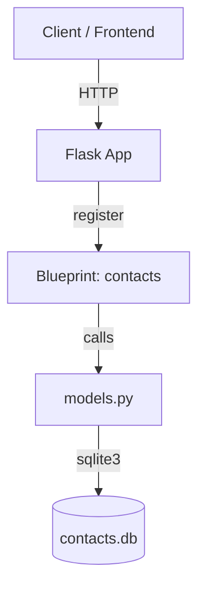

# 832301324_contacts_backend 📞🛠️

一个基于 Flask + SQLite 的简洁联系人后端服务。支持增删改查 REST API，提供跨域（CORS）支持，并附带一键部署脚本（Ubuntu，systemd + gunicorn）。

## ✨ 功能特性
- RESTful API：`/contacts` 提供查询、创建、更新、删除
- 轻量持久化：SQLite 本地 `contacts.db`
- CORS 支持：便于前端跨源访问
- 一键部署：`deploy.sh` 自动化环境检测、依赖安装、数据库初始化、systemd 常驻

## 🧩 设计与实现

- 分层结构：
  - `src/run.py`：应用入口，注册蓝图与 CORS
  - `src/controller/contacts.py`：路由控制器（Blueprint）
  - `src/models.py`：数据访问（直接使用 sqlite3）
  - `src/db_init.py`：数据库初始化（幂等创建表）

- 关键点：
  - 模型层使用常量 `DB_PATH='contacts.db'`，在项目根目录工作时可确保 SQLite 文件位置稳定
  - `deploy.sh` 使用 systemd 配置 `WorkingDirectory=${PROJECT_DIR}` 并设置 `PYTHONPATH=${PROJECT_DIR}/src`，gunicorn 通过 `--chdir ${PROJECT_DIR}` 加载 `src.run:app`
  - systemd `ExecStartPre` 在启动前执行一次 `db_init.py`，确保表存在，避免首次启动 500

### 📐 功能结构图



### 📦 目录结构

```text
832301324_concacts_backend/
   ├─ src/
   │  ├─ controller/
   │  │  └─ contacts.py
   │  ├─ db_init.py
   │  ├─ models.py
   │  └─ run.py
   ├─ requirements.txt
   ├─ deploy.sh
   └─ contacts.db (部署后生成)
```

## 🚀 部署步骤（Ubuntu，首次/更新均可）

> 已优化“按需安装”，不会每次重复 apt 安装。

```bash
cd 832301324_concacts_backend
chmod +x ./deploy.sh
./deploy.sh
```

- 部署脚本会执行：
  - 检测并按需安装：python3、python3-venv、pip、sqlite3、curl
  - 创建 `.venv` 并安装 `requirements.txt`
  - 运行 `src/db_init.py` 初始化表（ExecStartPre + 脚本内一次性执行）
  - 生成 systemd 服务 `contacts-backend` 并启动（gunicorn 监听 `0.0.0.0:5000`）
  - 打印公网 IP 与健康检查结果

### 🔌 运行与运维
```bash
# 查看状态
sudo systemctl status contacts-backend --no-pager -l
# 查看日志
journalctl -u contacts-backend -f
# 重启
sudo systemctl restart contacts-backend
```

### 🧪 API 速览
- GET `/contacts`：获取全部联系人
- POST `/contacts`：创建
  - JSON: `{ "name": "...", "phone": "...", "email": "", "note": "" }`
- PUT `/contacts/{id}`：更新
- DELETE `/contacts/{id}`：删除

## 🛡️ 常见问题
- 500 且日志提示 `no such table: contacts`：执行了数据库初始化后应消失；确保 `contacts.db` 位于项目根目录（脚本已保证 WorkingDirectory 与 PYTHONPATH 设置）。
- 公网可访问性问题：检查云服务安全组/防火墙放行 `5000/tcp`。


